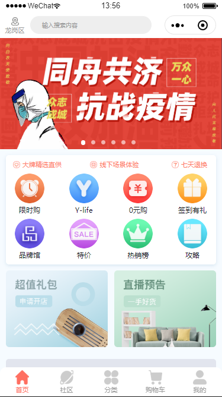

# SkeletonScreen

mini program SkeletonScreen  
小程序骨架屏组件 提升用户体验 skr~

## 效果展示



## 快速上手

## step 1

将本组件放到小程序目录的 component 目录

## step 2

在需要骨架屏加载的页面引入该组件

```json
//index.json
{
  "usingComponents": {
    "skeleton": "../component/skeleton/skeleton"
  }
}
```

```html
<!-- index.wxml -->

<!-- 骨架屏 -->
<skeleton
  root="skeleton"
  animation="shuttle"
  bgcolor="#fff"
  show="{{showSkeleton}}"
></skeleton>
```

## step 3

为需要骨架屏加载的页面的根节点添加特殊类名以便获取节点  
 本组件约定 根节点-rect 为矩形节点 根节点-circle 为圆形节点  
 请在需要骨架加载的节点上添加类名 如：

```html
<!-- index.wxml -->

<!-- 骨架屏 -->
<skeleton
  root="skeleton"
  animation="shuttle"
  bgcolor="#fff"
  show="{{showSkeleton}}"
></skeleton>

<!-- skeleton为根节点 -->
<view class="body skeleton">

  <view class="box">
      <view wx:for="{{rectlist}}" wx:key="index" class="rect skeleton-rect">{{item}}</view>
  </view>

  <view class="box">
      <view wx:for="{{circlelist}}" wx:key="index" class="circle skeleton-circle">{{item}}</view>
  </view>
</view>
```

## step 4
  1.初始化默认的数据，用于撑开页面结构，让组件可以获取到整体的页面结构  
  2.根据业务逻辑在从接口获取到后台数据后隐藏骨架屏
```javascript
// index.js
Page({
  data: {
    // 初始化默认的数据  
    rectlist:["rectdefaut1","rectdefaut2","rectdefaut3"]
    circlelist: ["circledefaut1","circledefaut2","circledefaut3"],
    showSkeleton: true, //骨架屏显示隐藏
  },
  onLoad() {
    let that = this;
    api.index().then(res => {
        if(res.data.status==0){
            let {rectlist,circlelist}=res.data
            that.setData({
                rectlist,
                circlelist
            },()=>{
                // 隐藏骨架屏
                that.setData({
                    showSkeleton:false
                })
            })
        }
    })
  },
  //   或用setTimeout延时隐藏骨架屏
});
```
## API
|Options|Required|Type|Default|Description|
|:-----:|:-----:|:--:|:-----:|:---------:|
|root|NO|string|skeleton|用于获取节点的根节点前缀，如`root="skt"`,那么根节点就是`class="skt"`,矩形节点为`class="skt-rect"`,圆形节点为`class="skt-circle"`|
|animation|NO|string|shuttle|骨架屏loading动画，`shuttle`和`gradient`两种可选|
|bgcolor|NO|string|#fff|骨架屏背景颜色|
|show|NO|boolean|false|控制骨架屏的显示与隐藏|

## tips
1.以最小节点原则添加相应class，如上文`<view class="box">`不要给box节点添加类名，否则渲染区域会很大，影响视觉效果。